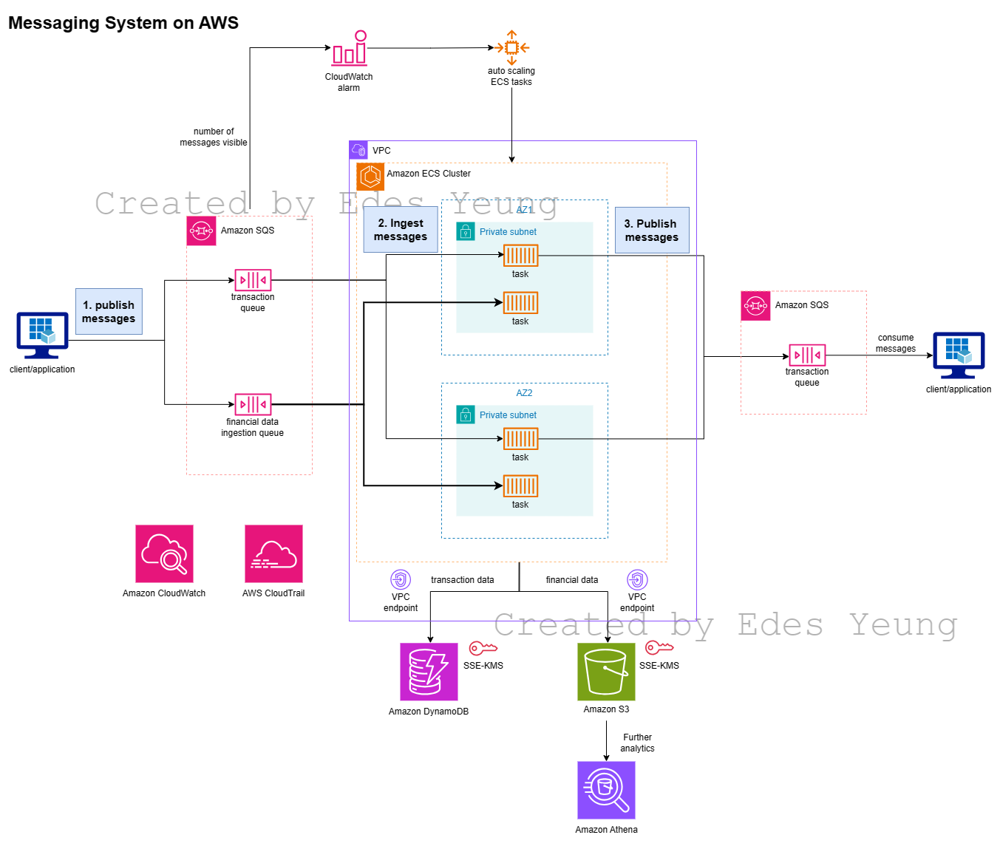

# Messaging System on AWS
To build a reliable, scalable messaging system, we can use a combination of AWS services. Here's a high-level overview of the architecture and services:

## Overall AWS Architecture Design
- The application layer hosted on **ECS**, acts as a backend, interacts with **S3** for data storage and retrieval, **DynamoDB** for transactional data storage and retrieval, and **SQS** for messaging. 
- **IAM** is used for access management. 
- **CloudWatch** and **CloudTrail** are used for monitoring and logging respectively.
## Secure Storage and Access Control
- Store the financial data in Amazon S3. Use S3 **bucket policies** and **IAM policies** for access control. Process the data parallelly in the ECS tasks to handle terabytes of data. For encryption, use S3 server-side encryption with AWS KMS managed keys (**SSE-KMS**).
- Use Amazon DynamoDB for storing the financial data. Use default encryption at rest with **AWS KMS managed keys** and **fine-grained access control** with IAM for secure data storage.
## Messaging Architecture
### Messaging mechanism
1. **Match Detection**:
	- Match detection can be done in the **ECS tasks**. Once it consumes the message from the SQS queue, it detects the predefined parameters from the DynamoDB to see if there is a match. 
2. **Task Execution:**
	- When a match is detected, the ECS task should generate unique tokens for the matched counterparties using cryptographic methods like hash functions. The token should be stored in Amazon DynamoDB for future reference.
	- Then, publish messages to the appropriate Amazon SQS queues, including the tokens and relevant data.
3. **Message Publication:**
	- The ECS task publishes messages to the relevant SQS queues.
	- Each message includes the token, message content, and any necessary metadata. Ensure that no identifying information is included in the messages.
	- Counterparties can consume these messages without revealing their identities.
### AWS service set up
- Amazon SQS is used for the messaging system. SQS is a fully managed message queuing service that enables you to decouple and scale microservices, distributed systems, and serverless applications. 
- Since message order is not required and the time of delivery is not restricted, use the **Standard Queue**, which provides maximum throughput and nearly a nearly unlimited number of API calls per second per API action.
- To keep counterparties anonymous, the application layer can handle the mapping of messages to counterparties, ensuring no identifying information is shared. 
- Set a `visibility timeout` in Amazon SQS to prevent other consumers from processing the message again.
- Configure the ECS task’s IAM role to allow it to publish messages to the SQS queues, ensuring that only authorized ECS tasks can perform this action.
- Enable AWS CloudTrail to monitor ECS task activity.
- Log relevant events inside the ECS task (e.g., token generation, message publication) for auditing purposes.
## High Availability and Disaster Recovery
- Use Amazon ECS **auto-scaling policies** based on the number of messages visible on each queue. Scaling across multiple Availability Zones to ensure high availability. 
- SQS automatically replicates all message data across multiple servers for high availability. Use **Dead Letter Queues** to sideline and investigate messages that can't be processed correctly
- For disaster recovery, regularly backup data using **AWS Backup** or **S3's versioning feature**. Use cross-region replication in case of a regional outage.
- Use **DynamoDB global tables** to replicate the tables across multiple regions. In the event of a regional outage, you can switch to a replica in another region.
- Regularly back up your **ECS task definitions** and service configurations. In case of a disaster, the ECS tasks can restore these in another region.
- Duplicate the messages across queues in different regions. This ensures that if a region goes down, the messages are still available in another region.
## Monitoring and Logging
- Use **Amazon CloudWatch** for monitoring the infrastructure. Set up alarms to get notified of any issues. For logging, use AWS CloudTrail.
- For the System log, use **Amazon EventBridge** to retrieve the keywords of the log. Trigger alarms when a certain keyword is found.
## Cost Optimization
- Use **Savings Plans** for compute resources (ECS/EC2). 
Use S3 lifecycle policies to help manage data so that it is stored cost-effectively. These policies can automatically migrate your data to lower-cost storage classes or archive or delete it altogether in certain circumstances.
- Use **DynamoDB's TTL** feature to automatically delete items that are no longer needed to reduce storage costs.
If the workload is unpredictable, consider using **DynamoDB On-Demand**, which offers flexible pricing where you pay per request. However, for large, predictable workloads, **provisioned capacity** can be more cost-effective.
For cost optimization in SQS, using **batching** can significantly reduce costs when performing high volumes of operations. Sending, receiving, or deleting messages is supported in batches in SQS.
- Regularly review and clean up unused resources using **Cost Explore** and enable **AWS Budgets** to monitor cost.
